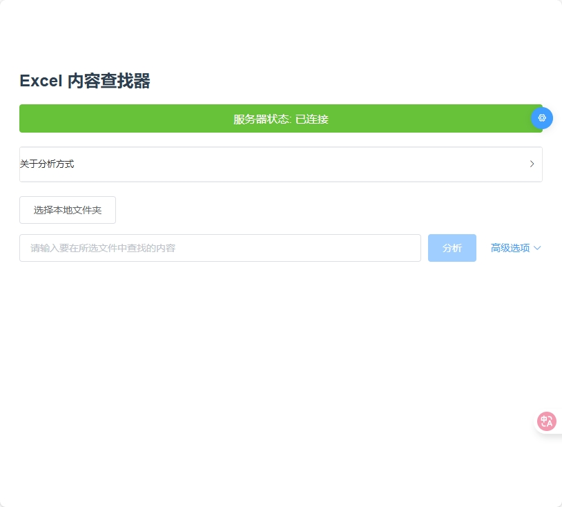

# ExcelAIFinder 文档图片插入指南

## 概述

本指南说明如何为ExcelAIFinder项目的四个主要文档添加配套图片，以提升文档的可读性和专业性。

## 🚨 重要提示：图片文件迁移

**原始图片位置**：`项目根目录/docs/images/`  
**新图片位置**：`文档鉴别材料/docs/images/`

### 需要手动复制的图片文件：

从 `项目根目录/docs/images/` 复制以下文件到 `文档鉴别材料/docs/images/`：

1. ✅ `main-interface.png` - 主界面截图
2. ✅ `file-selection.png` - 文件选择截图
3. ✅ `search-input.png` - 搜索输入截图
4. ✅ `advanced-options.png` - 高级选项截图
5. ✅ `analysis-progress.png` - 分析进度截图
6. ✅ `results-display.png` - 结果展示截图
7. ✅ `api-config.png` - API配置截图

### 手动复制步骤：

#### Windows系统：
```cmd
# 方法1：使用文件资源管理器
1. 打开项目根目录的 docs/images 文件夹
2. 选择所有PNG文件（Ctrl+A）
3. 复制文件（Ctrl+C）
4. 打开 文档鉴别材料/docs/images 文件夹
5. 粘贴文件（Ctrl+V）

# 方法2：使用命令行
copy "docs\images\*.png" "文档鉴别材料\docs\images\"
```

#### macOS/Linux系统：
```bash
cp docs/images/*.png 文档鉴别材料/docs/images/
```

## 图片命名规范

### 1. 使用说明书图片
- `main-interface.png` - 主界面截图
- `file-selection.png` - 文件选择截图  
- `search-input.png` - 搜索输入截图
- `advanced-options.png` - 高级选项截图
- `analysis-progress.png` - 分析进度截图
- `results-display.png` - 结果展示截图
- `api-config.png` - API配置截图

### 2. 设计开发文档图片
- `system-architecture.png` - 系统架构图
- `frontend-components.png` - 前端组件架构图
- `ai-integration.png` - AI集成架构图

### 3. 技术架构说明图片
- `architecture-overview.png` - 架构概览图
- `data-flow.png` - 数据流程图
- `deployment-diagram.png` - 部署架构图

### 4. 项目总结图片
- `performance-metrics.png` - 性能指标图表
- `feature-comparison.png` - 功能对比图
- `technology-stack.png` - 技术栈展示图

## 图片存储位置

所有图片应存储在以下目录结构中：

```
文档鉴别材料/
├── docs/
│   └── images/
│       ├── main-interface.png          ✅ 已存在
│       ├── file-selection.png          ✅ 已存在
│       ├── search-input.png            ✅ 已存在
│       ├── advanced-options.png        ✅ 已存在
│       ├── analysis-progress.png       ✅ 已存在
│       ├── results-display.png         ✅ 已存在
│       ├── api-config.png              ✅ 已存在
│       ├── system-architecture.png     ⚠️ 需要创建
│       ├── frontend-components.png     ⚠️ 需要创建
│       ├── ai-integration.png          ⚠️ 需要创建
│       ├── architecture-overview.png   ⚠️ 需要创建
│       ├── data-flow.png               ⚠️ 需要创建
│       ├── deployment-diagram.png      ⚠️ 需要创建
│       ├── performance-metrics.png     ⚠️ 需要创建
│       ├── feature-comparison.png      ⚠️ 需要创建
│       └── technology-stack.png        ⚠️ 需要创建
```

## 图片插入步骤

### 步骤1：复制现有图片文件
**重要**：首先将原始位置的图片文件复制到新位置
```bash
# 从项目根目录执行
cp docs/images/*.png 文档鉴别材料/docs/images/
```

### 步骤2：验证图片文件
确认以下文件已正确复制到 `文档鉴别材料/docs/images/`：
- [x] main-interface.png
- [x] file-selection.png  
- [x] search-input.png
- [x] advanced-options.png
- [x] analysis-progress.png
- [x] results-display.png
- [x] api-config.png

### 步骤3：创建缺失的图片文件
为其他文档创建所需的图片文件（如架构图、流程图等）

### 步骤4：验证图片链接
确认所有文档中的图片链接路径正确：
```markdown

```

## 图片路径说明

### ✅ 正确路径格式：
```markdown

```

### ❌ 错误路径格式：
```markdown
  # 多了 ./
 # 错误的相对路径
```

## 批量替换工具

如果需要批量更新图片路径，可以使用以下正则表达式：

### 查找模式：
```regex
!\[([^\]]*)\]\(\.\/docs\/images\/([^)]+)\)
```

### 替换模式：
```regex

```

## 验证清单

完成图片迁移后，请检查以下项目：

- [ ] 所有PNG文件已从 `docs/images/` 复制到 `文档鉴别材料/docs/images/`
- [ ] 文档中的图片路径已更新为 `docs/images/文件名.png`
- [ ] 在Markdown预览中能正常显示所有图片
- [ ] 图片文件大小合理（建议<2MB）
- [ ] 图片清晰度满足要求

## 推荐工具

### 图片编辑工具
- **Figma** - 用于创建架构图和流程图
- **Draw.io** - 免费的在线图表工具
- **Canva** - 用于创建专业的图表和展示图
- **Snagit** - 用于截取软件界面截图

### 图片优化工具
- **TinyPNG** - 在线图片压缩工具
- **ImageOptim** - Mac平台图片优化工具
- **GIMP** - 免费的图片编辑软件

## 图片质量要求

### 界面截图
- 分辨率：至少1920x1080
- 格式：PNG（保持清晰度）
- 内容：确保界面元素清晰可见
- 标注：重要功能区域可添加标注

### 架构图
- 分辨率：至少1200x800
- 格式：PNG或SVG
- 风格：保持一致的设计风格
- 文字：确保文字清晰可读

### 图表
- 分辨率：至少1000x600
- 格式：PNG
- 颜色：使用专业的配色方案
- 数据：确保数据准确性

## 注意事项

1. **版权问题**：确保所有使用的图片都有合法的使用权限
2. **文件大小**：控制图片文件大小，避免影响文档加载速度
3. **命名一致性**：严格按照命名规范命名图片文件
4. **路径正确性**：确保所有图片链接路径正确
5. **备份管理**：建议对图片文件进行版本控制和备份

## 更新日志

- **2025年5月30日**：创建图片插入指南，添加图片迁移说明
- **版本**：v1.1.0

---

*本指南将随着项目发展持续更新* 